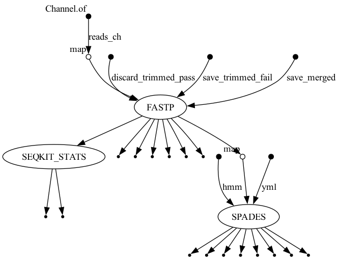

# BIOL7210 Nextflow Workflow

Nextflow pipeline for QC, assembly, and read statistics using fastp, SPAdes, and SeqKit.
Built for BIOL7210 at Georgia Tech.

## Workflow Overview



- **Module 1 (fastp)**: QC and trim raw paired-end reads
- **Module 2 (SPAdes)**: Assemble trimmed reads (runs in parallel with Module 3)
- **Module 3 (SeqKit Stats)**: Compute read statistics (runs in parallel with Module 2)

## Requirements

- Nextflow: v25.10.4
- Conda: v26.1.1
- OS: macOS (arm64)

## Test Data

Paired-end Illumina reads from *Staphylococcus aureus* (SRR1972917), trimmed to 25,000 reads.
Located in `test_data/`.

## Usage

```bash
conda activate nf

nextflow run main.nf -profile conda \
    --read1 test_data/sample_R1.fastq.gz \
    --read2 test_data/sample_R2.fastq.gz \
    --outdir results
```

## Output

Results are saved to `results/`.
